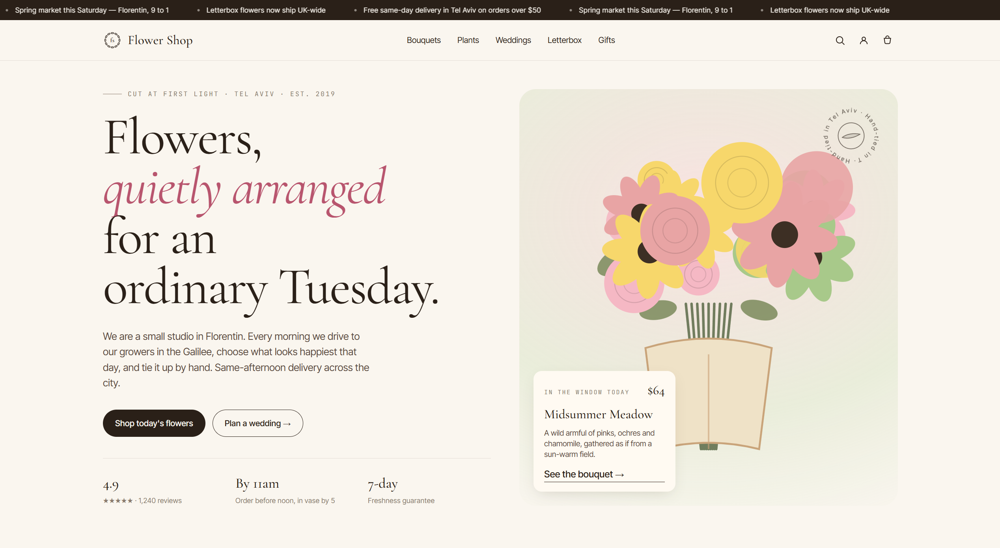
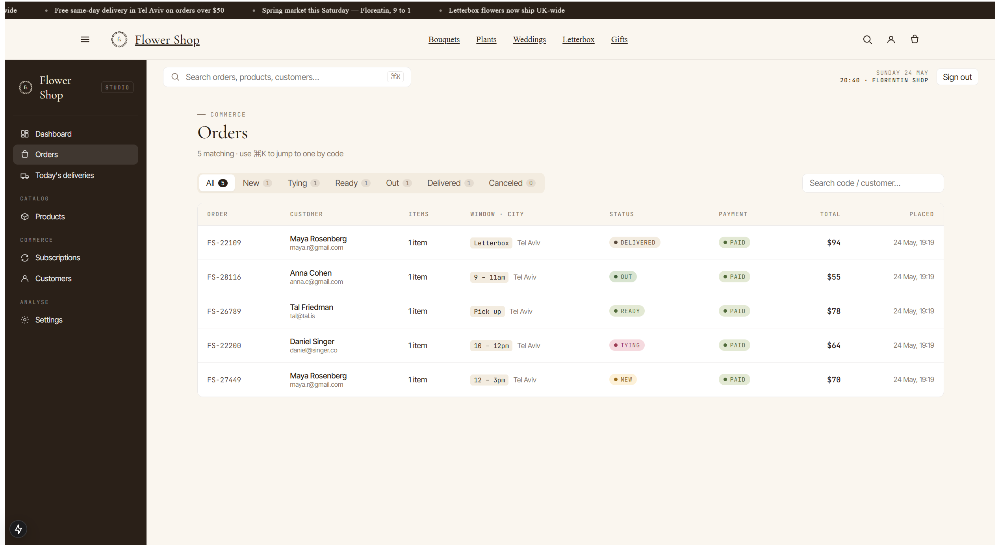

<div align="center">

# 🌸 Flower Shop · v2

**A self-owned florist storefront — Next.js, Postgres, Prisma, NextAuth, and an admin panel that doesn't pay rent to anyone.**


</div>

---

## What changed in v2

v1 was a redesign on top of **Wix Headless**. v2 brings the backend home:

| Layer | v1 | v2 |
|---|---|---|
| Products & cart | Wix Stores SDK | **Postgres** via Prisma |
| Cart & checkout | Wix `currentCart` + Wix redirect | **Own** anon-cart cookie + REST API |
| Auth | Wix OAuth visitor / member | **NextAuth** (magic links + Google + staff credentials) |
| Storage | Wix Media | **S3-compatible** (MinIO in dev, R2/S3 in prod) |
| Admin | Wix dashboard | **Custom** admin under `/admin` |
| Payments | Wix-hosted | Mocked — staff marks PAID in admin |


**P.S.** I know the sidebar, sign-in page, and a few other UI elements look a bit cringe right now, but I'll polish them in the upcoming updates! 🛠️

## Preview





## Tech stack

- **Next.js 15** App Router · server components, route handlers
- **TypeScript** end-to-end (including Prisma migrations & seeds)
- **PostgreSQL 16** + **Prisma 5** schema-first
- **NextAuth (Auth.js)** with three providers:
  - `EmailProvider` — magic links (customers)
  - `staff-credentials` — argon2 + JWT (staff/owner)
  - `GoogleProvider` — optional
- **Zod** for request validation
- **Zustand** for client cart + UI store
- **S3 / R2 / MinIO** for product photos via signed PUT URLs
- **Vitest** for unit tests · **Playwright** for E2E

## Quick start

### Prerequisites
- **Node.js 18.17+**
- **Docker** (or your own Postgres + Redis + S3-compatible storage)

### 1. Install
```bash
git clone <repo>
cd next-app
npm install
```

### 2. Boot the dev services
```bash
npm run docker:up
```
This brings up four containers:

| Service | Port | What it is |
|---|---|---|
| Postgres | 5432 | Primary database |
| Redis | 6379 | Future caching / rate limit |
| MinIO | 9000 (API), 9001 (console) | S3-compatible image storage |
| Mailhog | 1025 (SMTP), 8025 (web) | Catches magic-link emails |

### 3. Configure environment
```bash
cp .env.example .env.local
cp .env.example .env
#Ill fix this later

# generate a real secret:
openssl rand -base64 32 | xargs -I {} sed -i '' "s|replace-me-with-a-long-random-string|{}|" .env.local
```

### 4. Schema + seed
```bash
npm run db:migrate    # creates the schema
npm run db:seed       # seeds catalog + an owner account
```

…or do it all in one shot:
```bash
npm run setup
```

### 5. Run the app
```bash
npm run dev
```

| URL | What |
|---|---|
| http://localhost:3000 | Storefront |
| http://localhost:3000/admin | Admin (sign in as the owner) |
| http://localhost:3000/login | Customer sign-in (magic link via Mailhog) |
| http://localhost:8025 | Mailhog — opens the magic link emails |
| http://localhost:9001 | MinIO console (login `minio` / `miniominio`) |
| http://localhost:5555 | `npm run db:studio` — Prisma Studio (DB browser) |

**Default owner login** (set in `.env.local`):

```
email:    owner@flower-shop.local
password: studio
```
### Public
- `GET  /api/products` — list w/ filters (category, q, min, max, sort, page)
- `GET  /api/products/[slug]` — single product w/ variants + stems
- `GET  /api/categories`
- `GET  /api/cart` — current cart (anon or signed-in)
- `POST /api/cart` — add a line item
- `PATCH /api/cart/items/[id]` — update qty / vase / message (qty=0 removes)
- `DELETE /api/cart/items/[id]`
- `DELETE /api/cart` — clear the cart
- `POST /api/checkout` — convert the cart into an Order
- `GET  /api/orders?code=FS-XXXXX` — fetch own order (or guest with code only)
- `GET  /api/orders` — list own orders (signed in)

### Staff-only (`STAFF` or `OWNER`)
- `GET   /api/admin/dashboard` — KPIs + activity feed + stock alerts
- `GET   /api/admin/orders` — paged list with filters
- `GET   /api/admin/orders/[id]` — full order + events
- `PATCH /api/admin/orders/[id]` — change status / payment / append note
- `GET   /api/admin/products` — paged list
- `POST  /api/admin/products` — create
- `GET   /api/admin/products/[id]` — single
- `PATCH /api/admin/products/[id]` — update
- `DELETE /api/admin/products/[id]` — archive (default) or hard delete (`?hard=1`)
- `GET   /api/admin/customers` — paged list with LTV
- `POST  /api/admin/upload-url` — signed S3 PUT URL for product photography

### Auth
- `GET/POST /api/auth/*` — handled by NextAuth (sign-in, callback, sign-out, CSRF, providers)

All endpoints validate input via Zod and return JSON with appropriate status codes.

## Admin walkthrough

| Page | Purpose |
|---|---|
| `/admin` | Dashboard — today's revenue, status counts, activity feed, low stock |
| `/admin/orders` | Filterable order list with status tabs + search |
| `/admin/orders/[code]` | Order detail — line items, totals, customer, gift note, timeline; one-click status advance + payment marking |
| `/admin/deliveries` | Today's kanban — drag-style columns for New / Tying / Ready / Out |
| `/admin/products` | Catalog — sortable by status, sales, stock |
| `/admin/products/[id]` | Editor — basics, palette swatch picker, pricing, variant table |
| `/admin/customers` | Customer list with lifetime value |
| `/admin/subscriptions` | Active / paused / canceled plans with cadence and next-delivery |
| `/admin/settings` | Owner-only — shop hours + delivery windows |

## Authentication & roles

- **Customers** use *email magic links* — perfect for "I want to track my order" without remembering a password. The link is sent through whatever SMTP server you point `EMAIL_SERVER` at (Mailhog in dev).
- **Staff & owners** use *email + password* via the `staff-credentials` provider (argon2 hashes).
- **Google OAuth** is available if you set `GOOGLE_CLIENT_ID` and `GOOGLE_CLIENT_SECRET`.
- Roles ship through the JWT and land on `session.user.role`.
- `/admin/*` and `/account/*` are gated by `src/middleware.ts`.

To promote a customer to staff:
```sql
update "User" set role = 'STAFF' where email = 'naama@flower-shop.local';
```
…or use Prisma Studio.

## Images

In dev, MinIO acts as a local S3 — the bucket is auto-created at boot. To upload from the admin, the browser calls `POST /api/admin/upload-url`, then PUTs the file straight to MinIO; only the public URL gets stored in the database.

For production:
- **Cloudflare R2** — fast, S3-compatible, no egress fees. Set `S3_ENDPOINT=https://<account>.r2.cloudflarestorage.com`.
- **AWS S3** — drop the `S3_ENDPOINT` env var and the AWS SDK picks the right region URL.

## Tests

```bash
npm run test          # Vitest — unit
npm run test:watch
npm run test:e2e      # Playwright — opens a real browser
npm run test:e2e:ui   # Playwright UI mode
```

<div align="center">
<sub>If this saved you a Wix subscription, consider giving it a ⭐.</sub>
</div>